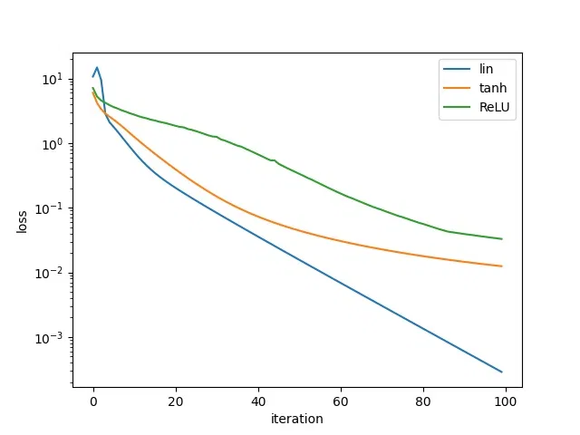
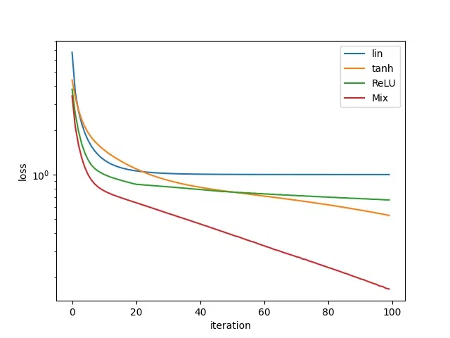
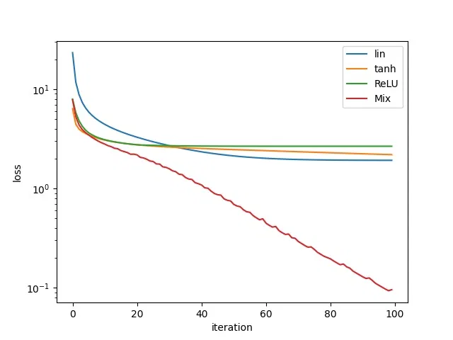
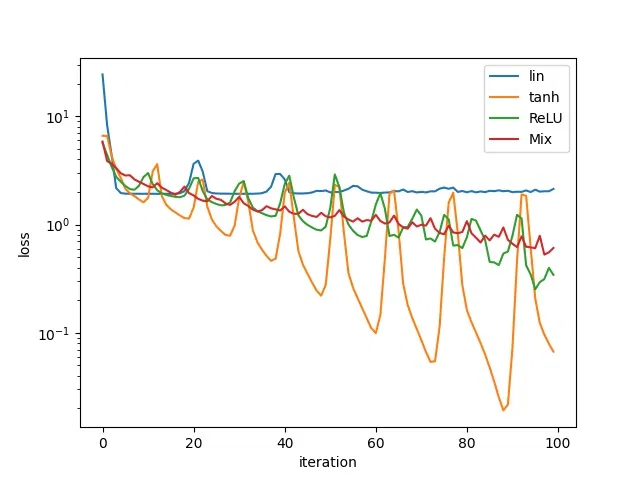
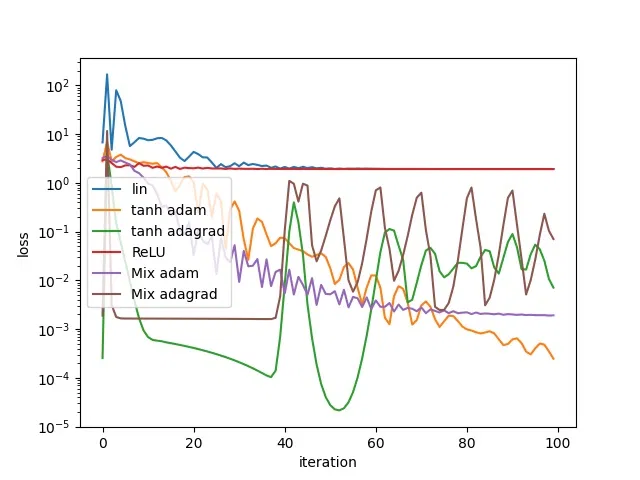
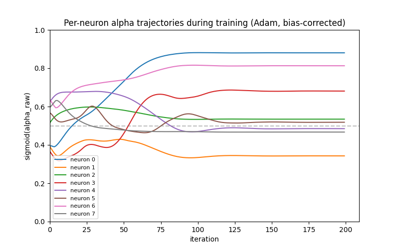
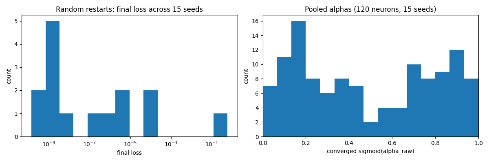
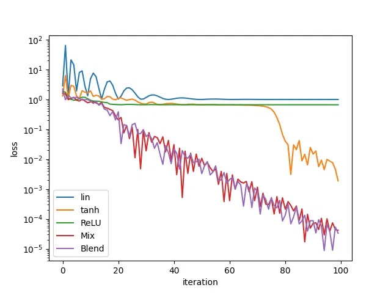

# micrograd-from-scratch

Reverse-mode automatic differentiation engines built from scratch in Python, as a
structured self-study project.
The emphasis throughout is on deriving and implementing the machinery myself — every
gradient is hand-derived and numerically verified — rather than using framework autograd.

Starts from Karpathy's [micrograd](https://karpathy.ai/zero-to-hero.html), with a
substantial layer of self-directed experiments on top.

## Scalar engine

- `engine.py` — a `Value` class implementing reverse-mode automatic differentiation:
  arithmetic ops with hand-written backward closures, topological-sort traversal,
  gradient accumulation.
- `nn.py` — `Neuron`/`Layer`/`MLP` built on the engine, with configurable activations
  including a learnable per-neuron tanh/ReLU blend (continuous relaxation of a discrete
  architecture choice, trained by gradient descent).
- Optimiser suite implemented from first principles: SGD, AdaGrad, RMSProp, Adam with
  bias correction — each motivated by the failure mode of the previous.
- `num_grad.py` — central-difference gradient checker; all ops verified to ~1e-9.

## Tensor engine

- `tensor/tensor.py` — a NumPy-backed autograd engine: broadcasting with correct
  backward (sum over broadcast axes via a two-step unbroadcast), matmul backward as
  vector-Jacobian products, reductions.
- `tensor/nn_tensor.py` — vectorised MLP: each layer is one matmul node rather than a
  graph of scalar operations.

## Experiments and analysis

Loss-landscape studies on XOR: activation comparisons, multi-seed distributions of the
learned activation blend, per-neuron training trajectories, random restarts. Plus a
quantitative stress test of the scalar engine — time scaling linear in parameters, the
recursion-depth wall induced by Python's `sum()` building linear graph chains, and a
measured ~10^4x scalar-vs-vectorised gap on identical computations, motivating the
tensor design empirically.

## Results

### Activation architecture



On the four-point toy regression set, the purely linear network converges fastest. The
target is close to linear, so nonlinearity buys nothing and only slows optimisation — a
benchmark where the simplest model wins is telling you about the data, not the model.



XOR is not linearly separable, so the linear network plateaus at chance. ReLU descends
faster early while tanh is smoother later; a per-layer mix of the two beats both pure
variants throughout, capturing each one's advantage in the regime where it holds.

### Optimisers



AdaGrad's accumulating denominator drives the effective learning rate
monotonically toward zero and training stalls — on every architecture except the mixed
one, which retains enough gradient signal to keep descending.



Repeating the comparison on a different seed with everything else held fixed, the mixed
architecture no longer holds a clear advantage, and moving from AdaGrad to
RMSProp changes little. The apparent advantage above is seed-dependent: the honest
reading is that mixing helps sometimes rather than reliably, which is why the population
analyses below use multiple seeds rather than one.



Adding momentum on the gradient itself damps the oscillation. The
adaptive-without-momentum variants swing over orders of magnitude while the Adam
variants descend smoothly, with the effect most pronounced on the mixed architecture.

### Learned per-neuron blending



Each neuron carries a learnable blend parameter between tanh and ReLU, trained by
gradient descent alongside the weights, to test whether neurons specialise or converge on
a shared activation. Trajectories start bunched near the midpoint, fan out, cross, and
freeze as the loss bottoms out — specialisation emerges during training rather than being
fixed at initialisation.



Left: final loss across 15 random restarts, most converging to ~1e-9 with one seed stuck
several orders of magnitude higher — which is why single-seed results are not evidence.
Right: pooling converged blend parameters across 120 neurons gives a roughly bimodal
distribution with a slight ReLU lean and the midpoint least populated. Given the freedom,
neurons commit toward one activation rather than averaging them.



Both the fixed per-layer mix and the learned per-neuron blend reach ~1e-5 while the pure
activations plateau three to four orders of magnitude higher. The learned blend matches
the hand-specified mix without being told which activation to use where.

## Running it

```bash
python -m venv .venv && source .venv/bin/activate
pip install -r requirements.txt
python demo.py
```

## Roadmap

Continued in a separate workspace: character-level language models
(bigram → MLP → batchnorm/initialisation → manual backprop → WaveNet), then a
transformer/GPT from scratch.

All code is my own implementation; external libraries are limited to NumPy and matplotlib.
